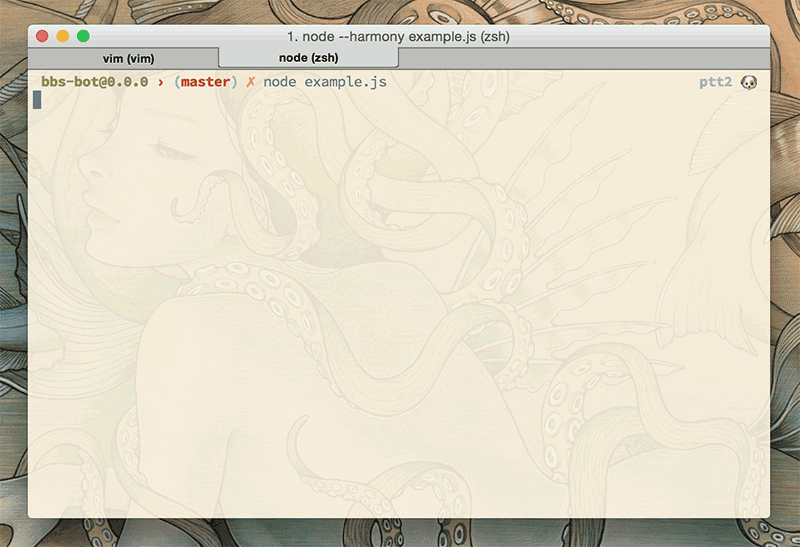
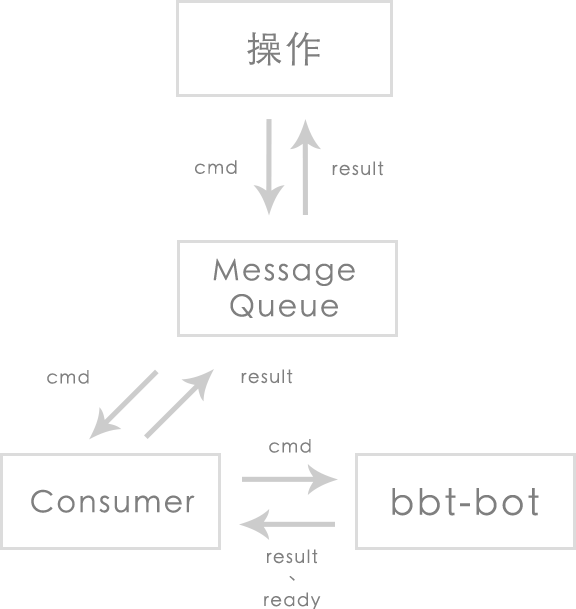

bbs-bot
=======

寫給 PTT 的機器人，修改 `states` 後可適用於其他 BBS 站台

### 基本想法

Telnet 是一個 server、client 之間不斷的來回溝通，所在規劃的時候發現我我們在程式中最常作的事情就是__等待__，等待某件事情發生後我們要給適當的回應。bot 跟我們操控者之間又是一個來回等待的過程，等待 bot 有空閒後我們才能給他下一個指令。

### Telnet Commands/Options

我們寫爬蟲其實不太需要知道 `Command`、`Option` 的實際內容，對於判斷頁面好像幫助不大，頂多 Debug 的時候看看我們到底接到了什麼 `Command`、`Option`，所以 `bbs-bot` 只解析出名稱而已，其他內容直接過濾掉（`SB`、`SE` 之間的內容）。

### Ansi 畫面

這部份幸好有人幫忙寫了（[terminal.js](https://github.com/Gottox/terminal.js)），`bbs-bot` 將過濾掉 `Command`、`Option` 的內容直接傳給 `terminal.js`，讓他來幫我們繪製畫面。

### States

我們的 `bot` 在任何時間點上必定處於某個 `state`，程式啟動時會在 `'boot'` `state` 上，當 `state` 是 `'pause'` 時代表 `bot` 目前閒置，可以接受使用者指令，使用者指令也是指定 `bot` 到某個 `state`。

### 異步、等待的處理方式

等待這件事使用 Generators 非常適合（coroutine），他讓我們程式碼比較容易閱讀，`bbs-bot` 使用 `co` 處理異步動作，用 `EventEmitter` 讓程式在多個 `co` 中互動。

### 程式碼簡易說明

整個程式分成三個部分，`Bot`、`Client`、`Screen`。

* `Screen`：包裝 `terminal.js`，加入一些功能方便 `Client` 操作
* `Client`：建立 Telnet 連線，解析 `Command`、`Option`，繪製 `Screen`
* `Bot`：包裝 `Client`，是 `Client` 跟主程式之間溝通的橋樑

### 實際使用情形

1. 操作者將指令丟給 MQ
2. Consumer 等待 `bbs-bot`
3. `bbs-bot` 處理完事情後（像是 login）指派 `ready` 事件
4. Consumer 聽到 `ready` 事件後把回傳資料塞回 MQ、DB 或作其他處理
5. 從 MQ 取得指令並發送給 `bbs-bot`
6. 回到 2

## License

The MIT License (MIT)

Copyright (c) 2014 Po-Ying Chen
